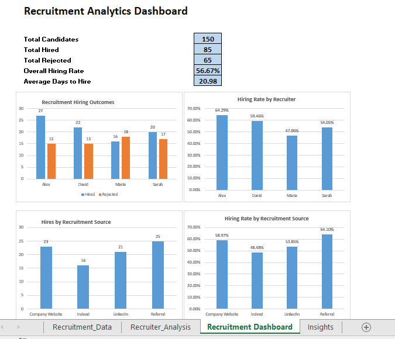

# Recruitment Analytics Dashboard – Excel

## Project Overview
This project analyzes recruitment data to evaluate hiring performance, recruiter effectiveness, and recruitment source effectiveness.

The project includes data analysis, KPIs, visualizations, an interactive-style Excel dashboard, business insights, and recommendations.

## Dashboard Preview

## Tools Used
- Microsoft Excel
- PivotTables
- PivotCharts
- Excel formulas
- Data visualization
- KPI analysis

## Key Performance Indicators
- Total Candidates: 150
- Total Hired: 85
- Total Rejected: 65
- Overall Hiring Rate: 56.67%
- Average Days to Hire: 20.98 days

## Analysis Performed
- Recruitment hiring outcomes by recruiter
- Hiring rate by recruiter
- Hires by recruitment source
- Hiring rate by recruitment source

## Key Insights
- Alex had the highest recruiter hiring rate at 64.29%.
- Maria had the lowest recruiter hiring rate at 47.06%.
- Referral had the highest recruitment source hiring rate at 64.10%.
- Referral generated the highest number of hires with 25.
- Indeed had the lowest recruitment source hiring rate at 48.48%.

## Business Recommendations
- Prioritize referral recruiting because it generated both the highest hiring rate and the highest number of hires.
- Review the Indeed recruitment process to identify opportunities to improve candidate conversion.
- Review practices used by higher-performing recruiters and determine whether effective approaches can be shared across the recruitment team.

## Project Files
`Recruitment_Analytics_Portfolio_Project.xlsx` contains the complete analysis, dashboard, insights, and recommendations.
